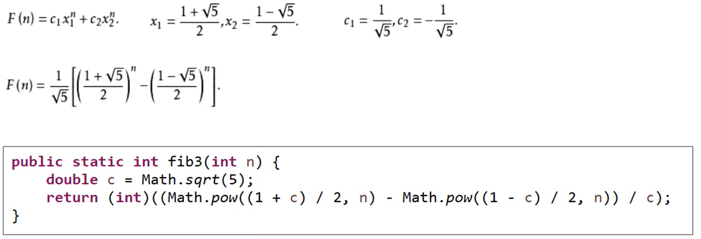
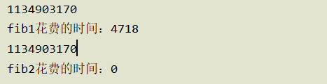
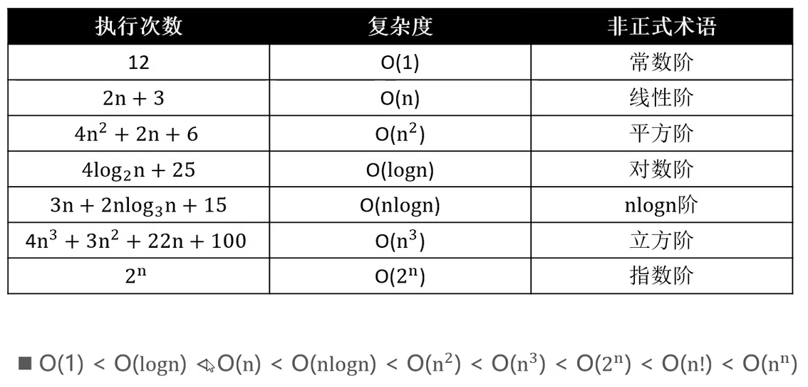
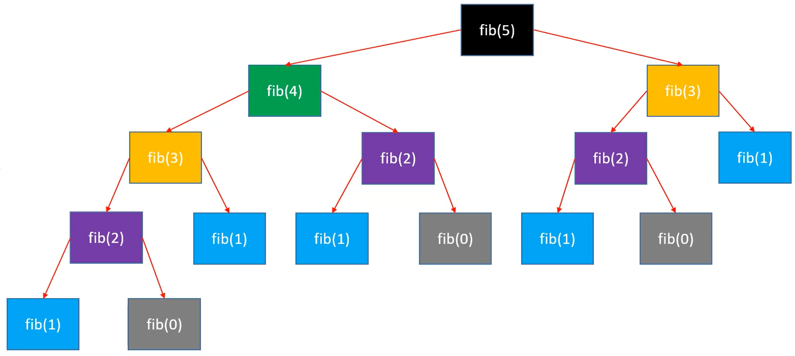

### 引入

**1 斐波那契数的计算**

方式1：使用递归

```java
public static int fib1(int n){
    if (n<=1) {
        return n;
    }
    return fib1(n-1)+fib1(n-2);
}
```

​	问题：效率低下需要进行多次计算，时间复杂度比较高。

方式2：

```java
public static int fib2(int n){
    if (n<=1) return n;
    int first=0;
    int second=1;
    for (int i = 0; i < n - 1; i++) {
        int sum=first+second;
        first=second;
        second=sum;
    }
    return second;
}
```

方式3：省略一些局部变量，降低空间复杂度。

```
public static int fib3(int n){
    if (n<=1) return n;
    int first=0;
    int second=1;
    while(n-- > 1){
    	second=second+first;
    	first=second-first;
    }
    return second;
}
```

方式4：线性代数的方式



时间复杂度的计算依赖于sqrt和pow的时间复杂度。

测试代码

```java
public static void main(String[] args) {
    long startTime=System.currentTimeMillis();
    System.out.println(fib1(45));
    long fib1EndTime=System.currentTimeMillis();
    System.out.println("fib1花费的时间："+(fib1EndTime-startTime));
    System.out.println(fib2(45));
    long fib2EndTime=System.currentTimeMillis();
    System.out.println("fib2花费的时间："+(fib2EndTime-fib1EndTime));
}
```

执行结果：



### 算法好坏的评估

一般我们评估算法的优劣：

- 正确定性，可读性，健壮性

- 时间复杂度：估算程序指令的执行次数（执行时间）

- 空间复杂度：估算一下所须占用的存储空间。

  如果两个算法都可以实现相同的功能我们当然趋向于使用耗时短，占用空间小的算法。

#### 1 事后统计法

​	如上图所示，将代码编写出来，然后进行测试，这种方法叫做事后统计法。

优点：

- 简单易于理解

缺点：

- 执行时间依赖硬件以及各种不确定环境因素
- 必须编写响应的测试代码
- 测试数据的选择很难保证公正性。

#### **2 事前分析法**

​	为了解决事后统计法存在的一些不便，我们可以采用事前分析法的方式，一般情况下，我们需要时间复杂度和空间复杂度进行分析即可

**1 时间复杂度的计算**

1. 根据汇编指令的方式来大概估算次数

2. 使用大O表示法来进行估算时间复杂度，表示数据规模n对应的复杂度。

- 忽略常数项：9>>O(1)
- 忽略系数：2n+3>>O(n)
- 忽略低阶：n^2+2*n+6>>O(n^2)
  - 4n^3+3*n^2+22n+100>>O(n^3)

- 对数阶一般忽略底数
  - log2(n)=log2(9)*log9(n)，所以统称为logn。

> 注意：仅仅是一种粗略的估算方式，只是一个大概值。又称为渐进时间复杂度。

常见的时间复杂度



**2 空间复杂度**

​	定义一个变量则可以定义认为占用了1，其计算方法是和时间复杂度保持一致。

**3 时间复杂度和空间复杂度的简单计算**

```java
public static void test1(int n) {
	// 汇编指令
	// 1
	if (n > 10) { 
		System.out.println("n > 10");
	} else if (n > 5) { // 2
		System.out.println("n > 5");
	} else {
		System.out.println("n <= 5"); 
	}
	
	// 1 + 4 + 4 + 4
	for (int i = 0; i < 4; i++) {
		System.out.println("test");
	}
	
	// 140000
	// O(1)
	// O(1)
}

public static void test2(int n) {
	// O(n)
	// 1 + 3n
	for (int i = 0; i < n; i++) {
		System.out.println("test");
	}
}

public static void test3(int n) {
	// 1 + 2n + n * (1 + 3n)
	// 1 + 2n + n + 3n^2
	// 3n^2 + 3n + 1
	// O(n^2)
	
	// O(n)
	for (int i = 0; i < n; i++) {
		for (int j = 0; j < n; j++) {
			System.out.println("test");
		}
	}
}

public static void test4(int n) {
	// 1 + 2n + n * (1 + 45)
	// 1 + 2n + 46n
	// 48n + 1
	// O(n)
	for (int i = 0; i < n; i++) {
		for (int j = 0; j < 15; j++) {
			System.out.println("test");
		}
	}
}

public static void test5(int n) {
	// 8 = 2^3
	// 16 = 2^4
	
	// 3 = log2(8)
	// 4 = log2(16)
	
	// 执行次数 = log2(n)
	// O(logn)
	while ((n = n / 2) > 0) {
		System.out.println("test");
	}
}

public static void test6(int n) {
	// log5(n)
	// O(logn)
	while ((n = n / 5) > 0) {
		System.out.println("test");
	}
}

public static void test7(int n) {
	// 1 + 2*log2(n) + log2(n) * (1 + 3n)
	
	// 1 + 3*log2(n) + 2 * nlog2(n)
	// O(nlogn)
	for (int i = 1; i < n; i = i * 2) {
		// 1 + 3n
		for (int j = 0; j < n; j++) {
			System.out.println("test");
		}
	}
}

public static void test10(int n) {
	// O(n)
	int a = 10;
	int b = 20;
	int c = a + b;
	int[] array = new int[n];
	for (int i = 0; i < array.length; i++) {
		System.out.println(array[i] + c);
	}
}
```
**4 简单思考**

1. 那么递归方式斐波那契的时间复杂度是多少呢？

   我们注意到每调用一次该函数则调用认为时间复杂度为1，那么如果我们输入5，则实际上调用了很多次该方法，如下图所示。



​	尽管我们只是计算第5个数值，但是我们发现实际上调用了大约15次，因为存在重复调用的问题，因此导致时间复杂度很高，大概为(2^n)/2，当我们对系数进行忽略，得到的时间复杂度为**n^2**。而方式2的时间复杂度我们可以大致认为是为**n**，随者n的增大，会导致两者的差距越来越大。

2. 算法的优化方向：

- 用尽量少的存储空间
- 用尽量少的步骤（时间复杂度要低）
- 根据实际情况：
  - 时间换空间：对于小型存储设备，不能占用过大的内存。
  - 空间换时间：对于计算机这种，可以相应的追求效率。

