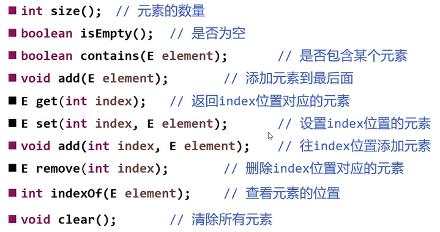
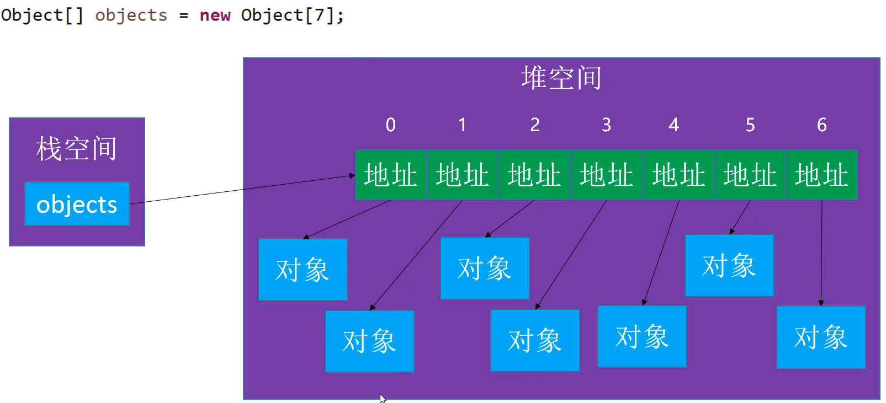

### 1 数据结构

#### 1 数据结构概述

​	数据结构是计算机存储，组织数据的方式。

#### 2 常见的数据结构

- 线性结构：数组，链表，栈，队列，哈希表(用到了数组，暂定为线性表)。
  - 线性表：具有n个相同类型元素的有限序列。
- 树形结构：二叉树，avl树，红黑树，B树，堆，Trie，哈夫曼树，并查集。
- 图形结构：邻接矩阵，邻接表。

### 2 数组

​	数组一种顺序存储的线性表，所有的元素的内存地址是连续的。

例如：int[ ]  array=new int[ ]{11,22,33};   

> 缺点：很多编程语言中，数组无法动态的修改容量。但是实际的开发过程中我们总是希望数组的长度是可以发生变化的。因此我们需要自己定义一个动态数组。
>

### 3 自定义动态数组

​	仿照ArrayList的的实现，简单实现增删改查。

#### 1 我们需要实现的方法



#### 2 代码逐步实现

##### 1 首先定义成员变量

```java
/**
 * 记录元素的数量
 */
private int size = 0;
/**
 * 存放元素
 */
private int[] elements;
/**
 * 我们要求如果传入容量小于10，就默认创建长度为10的数组
 */
private static final int DEFAULT_CAPACITY = 10;
/**
 * 查找的元素不存在的事后返回该常量
 */
private static final int ELEMENT_NOT_FOUND = -1;
```

##### 2 构造器的实现：需要对数组进行初始化。

```java
public DynamicArray2(int capacity) {
    //如果传入容量小于10，则创建一个容量为10数组
    capacity = (capacity < DEFAULT_CAPACITY) ? DEFAULT_CAPACITY : capacity;
    elements =new int[capacity];
}

public DynamicArray2() {
    //初始化参数
    this(DEFAULT_CAPACITY);
}
```

##### 3 一些方法的实现

​	size，isEmpty，get，set，indexOf，contains，clear，rangeCheck，rangeCheckAdd，showInfo，finalize，toString，add，remove，outOfBounds。

```java
/**
 * 返回集合中元素的个数
 * @return ：元素的个数
 */
public int size() {
    return size;
}

public boolean isEmpty() {
        return size == 0;
}

/**
* 获取指定下标的元素
* @param index ：指定的下标
* @return ：指定下标的元素
*/
public int get(int index) {
    rangeCheck(index);
    return elements[index];
}

/**
* 设置指定位置的元素，并返回改位置的就元素
* @param index   :指定下标
* @param element ：替换的元素
* @return ：被替换的元素
*/
public int set(int index, int element) {
    rangeCheck(index);
    int old = elements[index];
    elements[index] = element;
    return old;
}

/**
* 查看元素的索引
*
* @param element :查找的元素
* @return ：返回第一次出现指定元素的下标
*/
public int indexOf(int element) {
    for (int i = 0; i < size; i++) {
        if (element==elements[i]) {
            return i;
        }
    }
    return ELEMENT_NOT_FOUND;
}
/**
* 是否包含某值
*
* @param element ：元素值
*/
public boolean contains(int element) {
    return indexOf(element) != ELEMENT_NOT_FOUND;
}

/**
* 清除集合
*/
public void clear() {
   size = 0;
}

private void outOfBounds(int index) {
    throw new IndexOutOfBoundsException("index:" + index + ",size:" + size);
}

private void rangeCheck(int index) {
    if (index < 0 || index >= size) {
        //抛出数组下标越界异常
        outOfBounds(index);
    }
}

private void rangeCheckAdd(int index) {
    if (index < 0 || index > size) {
        //抛出数组下标越界异常
        outOfBounds(index);
    }
}

public void showInfo() {
   System.out.println(elements.length);
}

@Override
public String toString() {
    StringBuilder builder = new StringBuilder();
    builder.append("size=").append(size).append(",[");
    for (int i = 0; i < size - 1; i++) {
        builder.append(elements[i] + ",");
    }
    if (size>0){
        builder.append(elements[size - 1] + "]");
    }else {
        builder.append("]");
    }
    return builder.toString();
}

/**
* 向动态数组中添加元素
*
* @param element ：待添加的元素
*/
public void (int element) {
    add(size, element);
}

public void add(int index, int element) {
    //注意此处的参数判断：index和size的大小允许相等。
    rangeCheckAdd(index);
    /*for (int i = size; i >index; i--) {
            elements[i]=elements[i-1];
        }*/
    for (int i = size - 1; i >= index; i--) {
        elements[i + 1] = elements[i];
    }
    elements[index] = element;
    showInfo();
    size++;
}

 /**
* 删除指定位置处的元素
*
* @param index : 需要被删除的下标
* @return ：     被删除指定位置的元素
*/
public int remove(int index) {
    rangeCheck(index);
    int oldElement = elements[index];
    //将数组中的元素进行前移覆盖即可。
    for (int i = index + 1; i < size; i++) {
        //可以保证下标不会出现越界的情况
        elements[i - 1] = elements[i];
    }
    return oldElement;
}
```

##### 4 扩容的实现

​	扩容：当我们需要进行扩容的时候，因为底层是数组，不可能使用拼接的方式，因此我们需要申请一块连续的地址空间，并将当前数组中的元素复制到另外的数组中去。

```java
public void ensureCapacity(int capacity) {
    int oldCapacity = elements.length;
    if (oldCapacity >= capacity) {
        return;
    }
    int newCapacity = oldCapacity + (oldCapacity >> 1);
    int[] newElements = new int[newCapacity];
    //elements=Arrays.copyOf(elements,newCapacity);
    //对数组进行复制.这里采用这种方式当数据量比较大的时候，可以采用系统级别的拷贝方式，例如System.arraycopy();
    for (int i = 0; i < size; i++) {
        newElements[i] = elements[i];
    }
    elements = newElements;
}
```

因为我们添加了扩容的方法，所以add方法需要进行简单的修改

```java
public void add(int index, int element) {
   /* if (element==null){
        return;
    }*/
    //注意此处的参数判断：index和size的大小允许相等。
    rangeCheckAdd(index);
    /*for (int i = size; i >index; i--) {
        elements[i]=elements[i-1];
    }*/
    ensureCapacity(size + 1);
    for (int i = size - 1; i >= index; i--) {
        elements[i + 1] = elements[i];
    }
    elements[index] = element;
    showInfo();
    size++;
}
```

##### 5 存储对象的实现

分析：因为我们底层存储数据的数组是int类型，所以只能存储int类型数据，为了可以存储对象，需要进行修改，考虑使用泛型。

```java
package day01;

public class DynamicArray<E> {
    /**
     * 记录元素的数量
     */
    private int size = 0;
    /**
     * 存放元素
     */
    private E[] elements;
    private static final int DEFAULT_CAPACITY = 10;
    private static final int ELEMENT_NOT_FOUND = -1;

    public DynamicArray(int capacity) {
        capacity = (capacity < DEFAULT_CAPACITY) ? DEFAULT_CAPACITY : capacity;
        elements = (E[]) new Object[capacity];
    }

    public DynamicArray() {
        //初始化参数
        this(DEFAULT_CAPACITY);
    }

    /**
     * 返回集合中元素的个数
     *
     * @return ：元素的个数
     */
    public int size() {
        return size;
    }

    /**
     * 向动态数组中添加元素
     *
     * @param element ：待添加的元素
     */
    public void add(E element) {
        add(size, element);
    }

    public void add(int index, E element) {
       /*
       可以设置是否可以存储null
       if (element==null){
            return;
        }*/
        //注意此处的参数判断：index和size的大小允许相等。
        rangeCheckAdd(index);
        /*for (int i = size; i >index; i--) {
            elements[i]=elements[i-1];
        }*/
        ensureCapacity(size + 1);
        for (int i = size - 1; i >= index; i--) {
            elements[i + 1] = elements[i];
        }
        elements[index] = element;
        showInfo();
        size++;
    }

    /**
     * 保证要有capacity的容量足够
     *
     * @param capacity: 当前数组中元素的size+1
     */
    public void ensureCapacity(int capacity) {
        int oldCapacity = elements.length;
        if (oldCapacity >= capacity) {
            return;
        }
        int newCapacity = oldCapacity + (oldCapacity >> 1);
        E[] newElements = (E[]) new Object[newCapacity];
        //elements=Arrays.copyOf(elements,newCapacity);
        //对数组进行复制.这里采用这种方式当数据量比较大的时候，可以采用系统级别的拷贝方式，例如System.arraycopy();
        for (int i = 0; i < size; i++) {
            newElements[i] = elements[i];
        }
        elements = newElements;

    }

    public boolean isEmpty() {
        return size == 0;
    }

    /**
     * 获取指定下标的元素
     *
     * @param index ：指定的下标
     * @return ：指定下标的元素
     */
    public E get(int index) {
        rangeCheck(index);
        return elements[index];
    }


    /**
	 * 删除指定位置处的元素
 	 * @param index : 需要被删除的下标
	 * @return ：     被删除指定位置的元素
 	 */
    public E remove(int index){
        rangeCheck(index);
        E oldElement=elements[index];
        //将数组中的元素进行前移覆盖即可。
        for (int i = index+1; i < size; i++) {
            //可以保证下标不会出现越界的情况
            elements[i-1]=elements[i];
        }
        size--;
        return oldElement;
    }
    /**
     * 设置指定位置的元素，并返回改位置的就元素
     *
     * @param index   :指定下标
     * @param element ：替换的元素
     * @return ：被替换的元素
     */
    public E set(int index, E element) {
        rangeCheck(index);
        E old = elements[index];
        elements[index] = element;
        return old;
    }

    /**
     * 查看元素的索引
     *
     * @param element :查找的元素
     * @return ：返回第一次出现指定元素的下标
     */
    public int indexOf(E element){
        for (int i = 0; i < size; i++) {
            if (elements[i]==element){
                return i;
            }
        }
     	return ELEMENT_NOT_FOUND;
    }

    /**
     * 是否包含某值
     *
     * @param element ：元素值
     * @return ：是否包含某元素
     */
    public boolean contains(E element) {
        return indexOf(element) != ELEMENT_NOT_FOUND;
    }

    /**
     * 清除集合
     */
    public void clear(){
        size=0;
    }
    private void outOfBounds(int index) {
        throw new IndexOutOfBoundsException("index:" + index + ",size:" + size);
    }

    private void rangeCheck(int index) {
        if (index < 0 || index >= size) {
            //抛出数组下标越界异常
            outOfBounds(index);
        }
    }

    private void rangeCheckAdd(int index) {
        if (index < 0 || index > size) {
            //抛出数组下标越界异常
            outOfBounds(index);
        }
    }

    public void showInfo() {
        System.out.println(elements.length);
    }

    @Override
    public String toString() {
        StringBuilder builder = new StringBuilder();
        builder.append("size=").append(size).append(",[");
        for (int i = 0; i < size - 1; i++) {
            builder.append(elements[i] + ",");
        }
        if (size>0){
            builder.append(elements[size - 1] + "]");
        }else {
            builder.append("]");
        }
        return builder.toString();
    }
}
```

##### 6 存储对象的一些优化

**1 清空**

​	当存储的类型为基本数据类型的时候，直接size=0就可以了；但是当存储引用数据类型的时候，就不能这样进行处理。

对象数组的内存细节：



如果以现在的方式来看，当我们clear之后，当我们添加一个元素之后，其他应该被清空的对象依旧存在，会导致内存的浪费。

```java
/**
 * 清除集合
 */
public void clear(){
    size=0;
}
```

因此需要进行修改，如下所示。修改之后，那些对象会因为没有被引用，被gc所回收==>循环利用的留下，其他的去掉。

```java
public void clear(){
    for (int i = 0; i < size; i++) {
        elements[i]=null;
    }
    size=0;
}
```

回调函数来表明对象的死亡

```java
//对象死亡之后的回调函数
@Override
protected void finalize() throws Throwable {
    super.finalize();
    System.out.println("person - finalized");
}
```

**2 remove的修改**

​	remove的方法也需要进行处理，假如我们remove一个元素之后，会导致数组的最后会存在垃圾对象，对于这些对象我们应该对其进行回收。

```java
/**
 * 删除指定位置处的元素
 * @param index : 需要被删除的下标
 * @return ：     被删除指定位置的元素
 */
public E remove(int index){
    rangeCheck(index);
    E oldElement=elements[index];
    //将数组中的元素进行前移覆盖即可。
    for (int i = index+1; i < size; i++) {
        //可以保证下标不会出现越界的情况
        elements[i-1]=elements[i];
    }
    size--;
    return oldElement;
}
```

处理之后：

```java
public E remove(int index){
    rangeCheck(index);
    E oldElement=elements[index];
    //将数组中的元素进行前移覆盖即可。
    for (int i = index+1; i < size; i++) {
        //可以保证下标不会出现越界的情况
        elements[i-1]=elements[i];
    }
    elements[--size]=null;
    return oldElement;
}
```

**3 indexOf的实现**

对于对象的对比，一般是可以自定义是否相等的规则，所以不建议使用==

```java
public int indexOf(E element){
    for (int i = 0; i < size; i++) {
        if (elements[i]==element){
            return i;
        }
    }
    return ELEMENT_NOT_FOUND;
}
```

修改之后，建议使用equals

```java
public int indexOf(E element) {

    for (int i = 0; i < size; i++) {
        if (elements[i].equals(element)) {
            return i;
        }
    }
    return ELEMENT_NOT_FOUND;
}
```

**4 Null值的处理**

​	是否允许存放空值，这个规则由我们来定，默认的情况下是允许存放空值的，如果不允许存放空值，那么我们可以进行如下的处理。

```java
public void add(int index,E element){
    if (element==null){
        return;
    }
    //注意此处的参数判断：index和size的大小允许相等。
    rangeCheckAdd(index);
    ensureCapacity(size+1);
    for (int i = size-1; i>=index ; i--) {
        elements[i+1]=elements[i];
    }
    elements[index]=element;
    showInfo();
    size++;
}
```

但是我们在这里是允许存放空值，因此我们还需要对indexOf这个方法进行处理。

```java
public int indexOf(E element) {
    if (element == null) {
        for (int i = 0; i < size; i++) {
            if (elements[i] == null) {
                return i;
            }
        }
    } else {
        for (int i = 0; i < size; i++) {
            if (element.equals(elements[i])) {
                return i;
            }
        }
    }
    return ELEMENT_NOT_FOUND;
}
```

如果在这里不对其进行处理，如果某个元素是空，会造成空指针异常的出现。

##### 7 最终代码的实现

```java
package day01;

public class DynamicArray<E> {
    /**
     * 记录元素的数量
     */
    private int size = 0;
    /**
     * 存放元素
     */
    private E[] elements;
    private static final int DEFAULT_CAPACITY = 10;
    private static final int ELEMENT_NOT_FOUND = -1;

    public DynamicArray(int capacity) {
        capacity = (capacity < DEFAULT_CAPACITY) ? DEFAULT_CAPACITY : capacity;

        elements = (E[]) new Object[capacity];
    }

    public DynamicArray() {
        //初始化参数
        this(DEFAULT_CAPACITY);
    }

    /**
     * 返回集合中元素的个数
     *
     * @return ：元素的个数
     */
    public int size() {
        return size;
    }

    /**
     * 向动态数组中添加元素
     *
     * @param element ：待添加的元素
     */
    public void add(E element) {
        add(size, element);
    }

    public void add(int index, E element) {
       /* if (element==null){
            return;
        }*/
        //注意此处的参数判断：index和size的大小允许相等。
        rangeCheckAdd(index);
        /*for (int i = size; i >index; i--) {
            elements[i]=elements[i-1];
        }*/
        ensureCapacity(size + 1);
        for (int i = size - 1; i >= index; i--) {
            elements[i + 1] = elements[i];
        }
        elements[index] = element;
        showInfo();
        size++;
    }

    /**
     * 保证要有capacity的容量足够
     *
     * @param capacity: 当前数组中元素的size+1
     */
    public void ensureCapacity(int capacity) {
        int oldCapacity = elements.length;
        if (oldCapacity >= capacity) {
            return;
        }
        int newCapacity = oldCapacity + (oldCapacity >> 1);
        E[] newElements = (E[]) new Object[newCapacity];
        //elements=Arrays.copyOf(elements,newCapacity);
        //对数组进行复制.这里采用这种方式当数据量比较大的时候，可以采用系统级别的拷贝方式，例如System.arraycopy();
        for (int i = 0; i < size; i++) {
            newElements[i] = elements[i];
        }
        elements = newElements;

    }

    public boolean isEmpty() {
        return size == 0;
    }

    /**
     * 获取指定下标的元素
     *
     * @param index ：指定的下标
     * @return ：指定下标的元素
     */
    public E get(int index) {
        rangeCheck(index);
        return elements[index];
    }

    /**
     * 删除指定位置处的元素
     *
     * @param index : 需要被删除的下标
     * @return ：     被删除指定位置的元素
     */
    public E remove(int index) {
        rangeCheck(index);
        E oldElement = elements[index];
        //将数组中的元素进行前移覆盖即可。
        for (int i = index + 1; i < size; i++) {
            //可以保证下标不会出现越界的情况
            elements[i - 1] = elements[i];
        }
        //注意此处的是先--再清空。
        elements[--size] = null;
        return oldElement;
    }

    /**
     * 设置指定位置的元素，并返回改位置的就元素
     *
     * @param index   :指定下标
     * @param element ：替换的元素
     * @return ：被替换的元素
     */
    public E set(int index, E element) {
        rangeCheck(index);
        E old = elements[index];
        elements[index] = element;
        return old;
    }

    /**
     * 查看元素的索引
     *
     * @param element :查找的元素
     * @return ：返回第一次出现指定元素的下标
     */
    public int indexOf(E element) {
        if (element == null) {
            for (int i = 0; i < size; i++) {
                if (elements[i] == null) {
                    return i;
                }
            }
        } else {
            for (int i = 0; i < size; i++) {
                if (element.equals(elements[i])) {
                    return i;
                }
            }
        }
        return ELEMENT_NOT_FOUND;
    }

    /**
     * 是否包含某值
     *
     * @param element ：元素值
     * @return ：是否包含某元素
     */
    public boolean contains(E element) {
        return indexOf(element) != ELEMENT_NOT_FOUND;
    }

    /**
     * 清除集合
     */
    /*public void clear(){
        size=0;
    }*/
    public void clear() {
        for (int i = 0; i < size; i++) {
            elements[i] = null;
        }
        size = 0;
    }

    private void outOfBounds(int index) {
        throw new IndexOutOfBoundsException("index:" + index + ",size:" + size);
    }

    private void rangeCheck(int index) {
        if (index < 0 || index >= size) {
            //抛出数组下标越界异常
            outOfBounds(index);
        }
    }

    private void rangeCheckAdd(int index) {
        if (index < 0 || index > size) {
            //抛出数组下标越界异常
            outOfBounds(index);
        }
    }

    public void showInfo() {
        System.out.println(elements.length);
    }

    @Override
    public String toString() {
        StringBuilder builder = new StringBuilder();
        builder.append("size=").append(size).append(",[");
        for (int i = 0; i < size - 1; i++) {
            builder.append(elements[i] + ",");
        }
        if (size>0){
            builder.append(elements[size - 1] + "]");
        }else {
            builder.append("]");
        }
        return builder.toString();
    }

    //对象死亡之后的回调函数
    @Override
    protected void finalize() throws Throwable {
        super.finalize();
        System.out.println("person - finalized");
    }
}
```

#### 3 扩展

##### 1 add的进一步优化：只是一个小细节

```java
public void add(int index, E element) {
    /* if (element==null){
            return;
        }*/
    //注意此处的参数判断：index和size的大小允许相等。
    rangeCheckAdd(index);
    /*for (int i = size; i >index; i--) {
            elements[i]=elements[i-1];
        }*/
    ensureCapacity(size + 1);
    for (int i = size - 1; i >= index; i--) {
        elements[i + 1] = elements[i];
    }
    elements[index] = element;
    showInfo();
    size++;
}
```

对其中的for循环进行优化

可以从size开始，index+1结束，即代码如下

```java
public void add(int index, E element) {
    /* if (element==null){
            return;
        }*/
    //注意此处的参数判断：index和size的大小允许相等。
    rangeCheckAdd(index);
    ensureCapacity(size + 1);
    for (int i = size; i >index; i--) {
            elements[i]=elements[i-1];
    }
    elements[index] = element;
    showInfo();
    size++;
}
```

##### 2 添加一个remove方法

根据元素来删除集合中的元素

```java
public E remove(E element){
    E remove = remove(indexOf(element));
    return remove;
}
```

