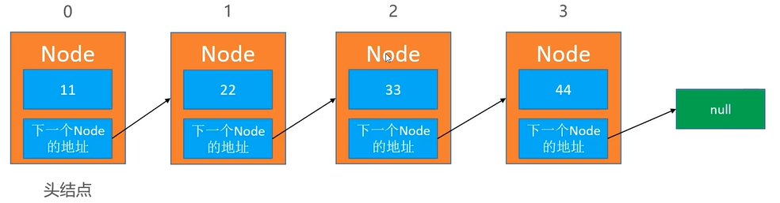
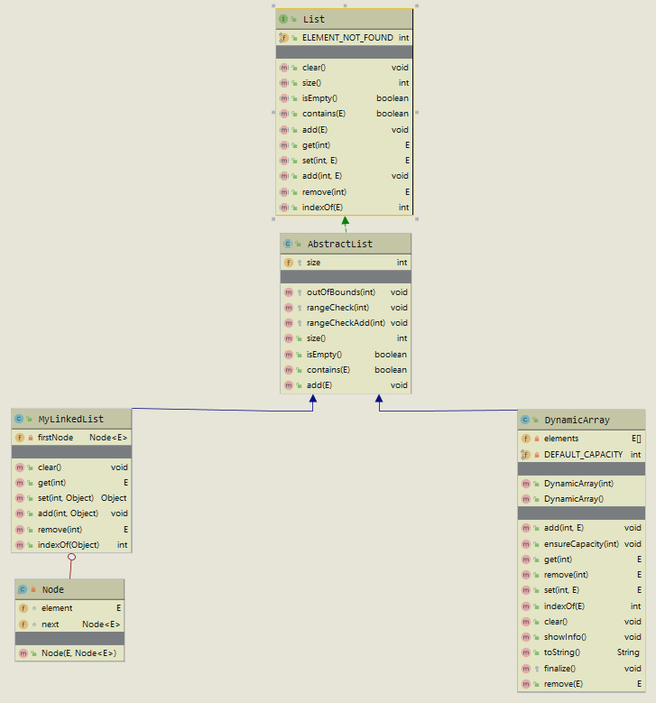

# 链表--Linked List

​	动态数组存在一个明显的缺点，当我们需要对数据进行删除，添加或者扩容的操作，会造成数组的复制，可能会造成内存空间的大量浪费。链表则与之不同，可以用多少就申请多少，是一种链式存储的线性表，所以元素的地址不一定是连续的。



### 1 实现一个链表

#### 1 类的结构的定义

```java
package com.day01;

public class MyLinkedList<E> {
    private int size;
    private Node<E> firstNode;

    /**
     * 定义为静态内部类
     */
    private static class Node<E>{
        E element;
        Node<E> next;

        public Node(E element, Node<E> next) {
            this.element = element;
            this.next = next;
        }
    }
}
```

#### 2 方法的定义

大多数方法都和数组是一样，因此我们可以定义一个接口List，让数组和现在的链表实现该接口即可

```java
package com.day01;

public interface List<E>{
    void clear();
    int size();
    boolean isEmpty();
    boolean contains(E element);
    void add(E element);
    E get(int index);
    E set(int index,E element);
    void add(int index,E element);
    E remove(int index);
    int indexOf(E element);

}
```

#### 3 共性抽取

定义一个AbstractList类将共性代码抽取出来，所以需要对类之间的关系进行重新设计。UML类图如下：



#### 4 LinkedList接口中方法的实现。

1）clear

​	直接将第一个节点置为null即可。

```java
@Override
public void clear() {
    //直接将头节点的的first指向null就可以
    firstNode=null;
}
```

> 注意：对于其中的每个节点，不需要分别指向null，因为第一个节点已经没有被引用了，所有必定会被回收掉。

2）add(int index,E element)

首先新建一个方法nodeIndex，可以根据索引获知指定的节点。

```java
/**
* 根据索引，返回指定的node节点
* @param index：指定的索引
* @return ：索引处的node节点
*/
private Node<E> indexNode(int index){
    //边界检查
    rangeCheck(index);
    //当前节点指向头节点
    Node<E> cur=firstNode;
    //找到指定索引
    for (int i = 0; i < index; i++) {
        cur=cur.next;
    }
    return cur;
}
```

根据这个方法，可以很轻易的写出get和set方法，如下所示。

```java
@Override
public E get(int index) {
    return indexNode(index).element;
}

@Override
public E set(int index, E element) {
    Node<E> node = indexNode(index);
    E oldElement=node.element;
    node.element=element;
    return oldElement;
}
```

当我们写链表的时候，一定要注意边界条件的检查，例如添加的时候：0，size，size-1

```java
@Override
public void add(int index, E element) {
    rangeCheckAdd(index);
    if (index==0){
        //第一次添加节点
        firstNode=new Node<>(element,firstNode);
    }else {
        //获取添加索引处的前一个节点
        Node<E> preNode = indexNode(index-1);
        //创建一个新的节点，next指向原来index位置的节点//index处的前一个节点指向新创建的节点
        preNode.next = new Node<>(element, preNode.next);
    }
    //元素的个数++
    size++;
}
```

3）remove的实现

```java
@Override
public E remove(int index) {
    rangeCheck(index);
    Node<E> node=firstNode;
    if (index==0){
        firstNode=firstNode.next;
    }else {
        //获取添加索引处的前一个节点
        Node<E> preNode = indexNode(index-1);
        //获取需要删除的节点
        node=preNode.next;
        //待删除节点的前一个节点的next属性指向删除节点的下一个节点。
        preNode.next=node.next;
    }
    //元素的个数++
    size--;
    return node.element;
}
```

网站：visualgo.net/zh：数据结构和算法动态可视化

4）重写toString

```java
@Override
public String toString() {
    StringBuilder builder = new StringBuilder();
    builder.append("size=").append(size).append(",[");
    Node<E> tempNode=firstNode;
    for (int i = 0; i < size; i++) {
        if (i!=0){
            builder.append(", ");
        }
        builder.append(tempNode.element);
        tempNode=tempNode.next;
    }
    builder.append("]");
    return builder.toString();
}
```

5）完整的代码

**list**

```java
package com.day01;

public interface List<E>{
    static final int ELEMENT_NOT_FOUND = -1;
    void clear();
    int size();
    boolean isEmpty();
    boolean contains(E element);
    void add(E element);
    E get(int index);
    E set(int index,E element);
    void add(int index,E element);
    E remove(int index);
    int indexOf(E element);

}
```

**AbstractList**

```java
package com.day01;

public abstract class AbstractList<E> implements List<E> {

    protected int size;

    protected void outOfBounds(int index) {
        throw new IndexOutOfBoundsException("index:" + index + ",size:" + size);
    }

    protected void rangeCheck(int index) {
        if (index < 0 || index >= size) {
            //抛出数组下标越界异常
            outOfBounds(index);
        }
    }
    protected void rangeCheckAdd(int index) {
        if (index < 0 || index > size) {
            //抛出数组下标越界异常
            outOfBounds(index);
        }
    }
    @Override
    public int size() {
        return size;
    }

    @Override
    public boolean isEmpty() {
        return size==0;
    }

    @Override
    public boolean contains(E element) {
        return indexOf(element)!=ELEMENT_NOT_FOUND;
    }

    @Override
    public void add(E element) {
        add(size,element);
    }
}
```

**MyLinkedList**

```java
package com.day01;

public class MyLinkedList<E> extends AbstractList<E> {

    private Node<E> firstNode;

    /**
     * 定义为静态内部类
     */
    private static class Node<E> {
        E element;
        Node<E> next;

        public Node(E element, Node<E> next) {
            this.element = element;
            this.next = next;
        }
    }

    @Override
    public void clear() {
        //直接将头节点的的first指向null就可以
        firstNode = null;
    }

    @Override
    public E get(int index) {
        return indexNode(index).element;
    }

    @Override
    public E set(int index, E element) {
        Node<E> node = indexNode(index);
        E oldElement = node.element;
        node.element = element;
        return oldElement;
    }

    /**
     * 根据索引，返回指定的node节点
     *
     * @param index：指定的索引
     * @return ：索引处的node节点
     */
    private Node<E> indexNode(int index) {
        //边界检查
        rangeCheck(index);
        //当前节点指向头节点
        Node<E> cur = firstNode;
        //找到指定索引
        for (int i = 0; i < index; i++) {
            cur = cur.next;
        }
        return cur;
    }

    @Override
    public void add(int index, E element) {
        rangeCheckAdd(index);
        if (index == 0) {
            //firstNode.next=new Node<>(element,firstNode.next);
            firstNode = new Node<>(element, firstNode);
        } else {
            //获取添加索引处的前一个节点
            Node<E> preNode = indexNode(index - 1);
            //创建一个新的节点，next指向原来index位置的节点//index处的前一个节点指向新创建的节点
            preNode.next = new Node<>(element, preNode.next);
        }
        //元素的个数++
        size++;
    }

    @Override
    public E remove(int index) {
        rangeCheck(index);
        Node<E> node = firstNode;
        if (index == 0) {
            firstNode = firstNode.next;
        } else {
            //获取添加索引处的前一个节点
            Node<E> preNode = indexNode(index - 1);
            //获取需要删除的节点
            node = preNode.next;
            preNode.next = node.next;
        }
        //元素的个数++
        size--;
        return node.element;
    }

    @Override
    public int indexOf(E element) {
        if (element == null) {
            Node<E> node = firstNode;
            for (int i = 0; i < size; i++) {
                if (node.element == null) {
                    return i;
                }
                node = node.next;
            }
        } else {
            Node<E> node = firstNode;
            for (int i = 0; i < size; i++) {
                if (element.equals(node.element)) {
                    return i;
                }
                node = node.next;
            }
        }
        return ELEMENT_NOT_FOUND;
    }

    @Override
    public String toString() {
        StringBuilder builder = new StringBuilder();
        builder.append("size=").append(size).append(",[");
        Node<E> tempNode = firstNode;
        for (int i = 0; i < size; i++) {
            if (i != 0) {
                builder.append(", ");
            }
            builder.append(tempNode.element);
            tempNode = tempNode.next;
        }
        builder.append("]");
        return builder.toString();
    }

}
```

### 2 练习

##### 1 删除链表中的节点

```java
public class ListNode {
    int val;
    ListNode next;
    ListNode(int x) { val = x; }
}


/**
 * 237. 删除链表中的节点
 */
public class 删除链表中的节点_237 {

    /**
     * 小技巧：
     * 以前我们删除链表中节点的时候需要我们找到当前节点的前一个节点，但是此时我们是无法获取前一个节点的信息的。
     * 因此需要用其他的方式来实现。当前节点就是要删除的节点，因为要删除的节点就是当前要删除的节点，因此我们可以采用值覆盖。
     * @param node
     */
    public void deleteNode(ListNode node) {
        node.val=node.next.val;
        node.next=node.next.next;
    }

}
```

##### 2 反转链表

1）递归的方式实现：


```java
/**
 * 递归的方式实现链表的反转
 * @param head 传入头节点
 * @return
 */
public ListNode reverseList2(ListNode head) {
    //边界条件的判断
    if(head==null||head.next==null){
        return head;
    }
    ListNode newHead=reverseList2(head.next);
    head.next.next=head;
    head.next=null;
    return newHead;
}
```

2）迭代的方式实现：


```java
/**
 * https://leetcode-cn.com/problems/reverse-linked-list/
 */
public class 反转链表_206 {
    /**
     * 迭代的方式实现
     * @param head ：传入头节点
     * @return ：返回新的链表头
     */
    public ListNode reverseList(ListNode head) {
        ListNode cur=head;
        ListNode preNode=null;
        while(cur!=null){
            //保存下一个节点
            ListNode temp=cur.next;
            //当前节点指向上一个节点
            cur.next=preNode;
            //节点后移动
            preNode=cur;
            cur=temp;
        }
        return preNode;
    }
}
```

##### 3 判断是否有环

```java
/**
 * 使用快慢指针的方式来解决
 * 联想：跑步套圈
 * @param head ：头节点
 * @return ：尾节点
 */
public boolean hasCycle(ListNode head) {
    if (head == null || head.next ==null){
        return false;
    }
    ListNode slowNode = head;
    ListNode fastNode = head.next;
    while (fastNode != null && fastNode.next != null){
        if (slowNode == fastNode){
            return true;
        }
        slowNode = slowNode.next;
        fastNode = fastNode.next.next;
    }
    return false;
}
```

几个问题？

1）时间复杂度是：O(n)

​	时间复杂度和快指针相关，最坏的情况下是n/2，所以可以称之为O(n)。

2）为什么判断条件是：`fastNode != null && fastNode.next != null`是否可以省略？

​	不可以，因为`fastNode = fastNode.next.next;`有可能出现空指针异常。

3）为什么一个快指针要走两步，为什么不走三步？

​	因为每次都两布，如果存在环，两者的距离每次缩小一步，可以保证每个节点都走到。如果走三步，每次缩小两步，有可能出现错过的情况。

#### 6 作业


### 3 虚拟头节点

> 有时候为了代码更加的精简，统一所有节点的处理逻辑，可以在最前面增加一个虚拟的头节点，不存储数据。


将之前的一个LinkedList进行一个修改，修改为虚拟头节点的写法。

```java
/**
 * @author 龍
 */
public class MyLinkedList2<E> extends AbstractList<E> {

    private Node<E> firstNode;

    public MyLinkedList2(){
        firstNode=new Node<>(null, null);
    }

    /**
     * 定义为静态内部类
     */
    private static class Node<E> {
        E element;
        Node<E> next;

        public Node(E element, Node<E> next) {
            this.element = element;
            this.next = next;
        }
    }

    @Override
    public void clear() {
        //直接将头节点的的first指向null就可以
        firstNode = null;
    }

    @Override
    public E get(int index) {
        return indexNode(index).element;
    }

    @Override
    public E set(int index, E element) {
        Node<E> node = indexNode(index);
        E oldElement = node.element;
        node.element = element;
        return oldElement;
    }

    /**
     * 根据索引，返回指定的node节点
     *
     * @param index：指定的索引
     * @return ：索引处的node节点
     */
    private Node<E> indexNode(int index) {
        //边界检查
        rangeCheck(index);
        //调整：第一个节点指向虚拟头节点的下一个元素
        Node<E> cur = firstNode.next;
        //找到指定索引
        for (int i = 0; i < index; i++) {
            cur = cur.next;
        }
        return cur;
    }

    @Override
    public void add(int index, E element) {
        rangeCheckAdd(index);
        /*
        //因为存在虚拟头节点，所以可以直接使用firstNode，不需要特殊处理
        if (index == 0) {
            //firstNode.next=new Node<>(element,firstNode.next);
            firstNode = new Node<>(element, firstNode);
        } else {*/
            //获取添加索引处的前一个节点。如果index为0则前一个节点是虚拟头节点。
            Node<E> preNode = index == 0 ? firstNode:indexNode(index - 1);
            //创建一个新的节点，next指向原来index位置的节点//index处的前一个节点指向新创建的节点
            preNode.next = new Node<>(element, preNode.next);
        //}
        //元素的个数++
        size++;
    }

    @Override
    public E remove(int index) {
        //对下标进行索引范围的检查
        rangeCheck(index);
        Node<E> node = firstNode;
        /*if (index == 0) {
            firstNode = firstNode.next;
        } else {*/
            //获取添加索引处的前一个节点
            Node<E> preNode = index ==0? firstNode : indexNode(index - 1);
            //获取需要删除的节点
            node = preNode.next;
            preNode.next = node.next;
        //}
        //元素的个数++
        size--;
        return node.element;
    }

    @Override
    public int indexOf(E element) {
        if (element == null) {
            Node<E> node = firstNode;
            for (int i = 0; i < size; i++) {
                if (node.element == null) {
                    return i;
                }
                node = node.next;
            }
        } else {
            Node<E> node = firstNode;
            for (int i = 0; i < size; i++) {
                if (element.equals(node.element)) {
                    return i;
                }
                node = node.next;
            }
        }
        return ELEMENT_NOT_FOUND;
    }

    @Override
    public String toString() {
        StringBuilder builder = new StringBuilder();
        builder.append("size=").append(size).append(",[");
        //firstNode.next来进行拼接
        Node<E> tempNode = firstNode.next;
        for (int i = 0; i < size; i++) {
            if (i != 0) {
                builder.append(", ");
            }
            builder.append(tempNode.element);
            tempNode = tempNode.next;
        }
        builder.append("]");
        return builder.toString();
    }

}
```


### 4 静态链表

之前所学的链表，是依赖于指针实现的。有些编程语言没有指针，那么如何实现链表？

使用数组来模拟链表，称为静态链表，数组的每个元素存放两个数据：值和下一个元素的索引。


如果不能使用这样的结构，如何解决？

使用两个数组，一个数组存放索引关系，一个数组存放值。